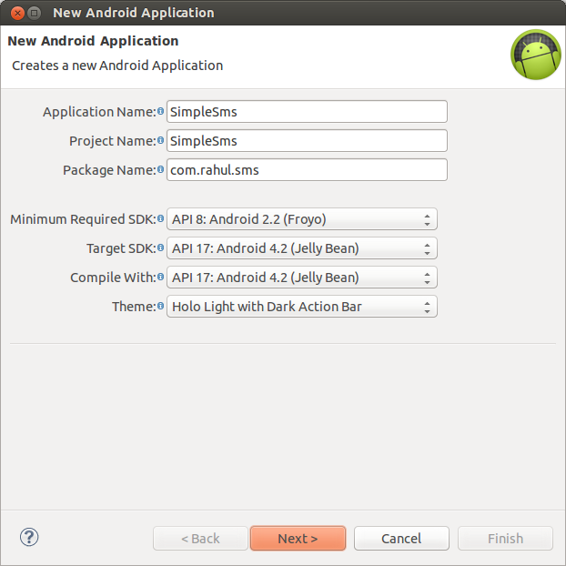

In this post I will be skimming through the basics of sending and receiving an SMS with your Android device. The task is really simple and barely requires 50 lines of code! The application which we will be developing below will take in a number and a message as inputs and sends an SMS to that number. 

It will also create a <a href="http://developer.android.com/guide/topics/ui/notifiers/toasts.html" target="_blank">Toast</a> when there is an incoming message (with the message content and the sender&#8217;s number. I may go into retrieval of numbers from a contact list in the next blog, but for now you will have to manually key in the numbers).

So let&#8217;s get into some coding!

First of all, as usual, create a new Android project (I will be using Eclipse). For any beginners reading through this blog, here is how you create a project. Others can skip this part.

* In Eclipse, go to File &#8212; New &#8212; Android Application Project.
* You should get a screen like this


  
* Fill in all the details and click &#8216;Next&#8217;. (For a full explanation click <a href="http://developer.android.com/training/basics/firstapp/creating-project.html" target="_blank">here</a>)
* You can leave all the settings to default in the next screens and click &#8216;Finish&#8217;

### Layout

For this app, a very simple layout is sufficient as shown below.</p> 
    
```java
<RelativeLayout xmlns:android="http://schemas.android.com/apk/res/android"
    xmlns:tools="http://schemas.android.com/tools"
    android:layout_width="match_parent"
    android:layout_height="match_parent"
    android:paddingBottom="@dimen/activity_vertical_margin"
    android:paddingLeft="@dimen/activity_horizontal_margin"
    android:paddingRight="@dimen/activity_horizontal_margin"
    android:paddingTop="@dimen/activity_vertical_margin"
    tools:context=".MainActivity" >

    <LinearLayout
        android:id="@+id/ll"
        android:layout_width="match_parent"
        android:layout_height="wrap_content"
        android:layout_alignParentTop="true"
        android:layout_centerHorizontal="true"
        android:layout_marginTop="16dp" >

        <Button
            android:id="@+id/btn_send"
            android:layout_width="wrap_content"
            android:layout_height="wrap_content"
            android:layout_weight="1"
            android:text="@string/msg_btn_send" />

        <Button
            android:id="@+id/btn_clear"
            android:layout_width="wrap_content"
            android:layout_height="wrap_content"
            android:layout_weight="1"
            android:text="@string/msg_btn_clear" />
    </LinearLayout>

    <EditText
        android:id="@+id/et_number"
        android:layout_width="match_parent"
        android:layout_height="wrap_content"
        android:layout_alignLeft="@+id/ll"
        android:layout_below="@+id/ll"
        android:ems="10"
        android:hint="@string/hint_number"
        android:inputType="phone" >

        <requestFocus />
    </EditText>

    <EditText
        android:id="@+id/et_msg"
        android:layout_width="match_parent"
        android:layout_height="match_parent"
        android:layout_alignLeft="@+id/et_number"
        android:layout_below="@+id/et_number"
        android:ems="10"
        android:hint="@string/hint_msg"
        android:inputType="textMultiLine" />

</RelativeLayout>
```

When the layout is ready, it should look something like this.
    
{% include image.html url="../res/framed_main_screen.png" description="" scale="50%" %}
    
In this layout, there are 2 <b><i>buttons</i></b> and 2 <b><i>edit texts</i></b>.</p> 
      
* <b>btn_send</b> : <i>button used to send the message</i>
* <b>btn_clear</b> : <i>button to clear the edit texts</i>
* <b>et_msg</b> : <i>edit text for typing in the message</i>
* <b>et_number</b> : <i>edit text for typing in the number</i>

When the layout is ready, it should look something like this.</p> 
        
### Android Manifest

Since the application needs to send, receive and read text messages, the app must get explicit permission from the user to do so.

Also, when a message arrives the app must be informed about it so it can do what is to be done (Here we just display the sender&#8217;s number and the message&#8217;s content). Therefore a broadcast receiver must be registered with the Android system so that it can inform the receiver whenever a new message arrives. This process of declaring the permissions required by the app to run and registering a receiver is done in the Android Manifest.xml

The code of this file is as follows and you can see the permissions declared above the <b>application</b> tag and the receiver which listens to incoming messages registered within the <b>application</b> tag below the <b>activity</b> tag.

```java
<?xml version="1.0" encoding="utf-8"?>
<manifest xmlns:android="http://schemas.android.com/apk/res/android"
    package="com.rahul.sms"
    android:versionCode="1"
    android:versionName="1.0" >

    <uses-sdk
        android:minSdkVersion="8"
        android:targetSdkVersion="17" />

    <uses-permission android:name="android.permission.SEND_SMS" />
    <uses-permission android:name="android.permission.READ_SMS" />
    <uses-permission android:name="android.permission.RECEIVE_SMS" />

    <application
        android:allowBackup="true"
        android:icon="@drawable/ic_launcher"
        android:label="@string/app_name"
        android:theme="@style/AppTheme" >
        <activity
            android:name="com.rahul.sms.MainActivity"
            android:label="@string/app_name" >
            <intent-filter>
                <action android:name="android.intent.action.MAIN" />

                <category android:name="android.intent.category.LAUNCHER" />
            </intent-filter>
        </activity>

        <receiver android:name=".SmsReceiver" >
            <intent-filter>
                <action android:name="android.provider.Telephony.SMS_RECEIVED" /
            </intent-filter>
        </receiver>
    </application>

</manifest>
```

### Strings.xml

It is a good practice to put all your string in an XML file and not hard coding them because it will save you from re-writing code if and when you wish to internationalize your app or release the app in a different language. It will also help when you are creating apps compatible to different screen sizes. Here are the set of strings I will be using in this app. This snippet is from the Strings.xml file
     
```java
<resources>

    <string name="app_name">Simple SMS</string>
    <string name="action_settings">Settings</string>
    <string name="hello_world">Hello world!</string>
    <string name="msg_btn_send">Send</string>
    <string name="msg_btn_clear">Clear</string>
    <string name="hint_number">Enter number</string>
    <string name="hint_msg">Enter message</string>

</resources>
```
      
Now all the peripherals are ready and we can get into the core functionality. This is divided into two parts :
* MainActivity.java
* SmsReceiver.java

### MainActivity.java

This activity binds the user interface (XML) to java code so that we can tell Android what to do when some events (such as click of a button) occurs. Since we are starting out with a simplistic approach, we only have 2 buttons <b>Send</b> and <b>Clear</b>. The Send button sends a message and the Clear button clears the content in the text boxes. The code is as follows :

```java
public class MainActivity extends Activity implements OnClickListener {

Button btnSend, btnClear;
EditText etNumber, etMsg;

@Override
protected void onCreate(Bundle savedInstanceState) {
	super.onCreate(savedInstanceState);
	setContentView(R.layout.activity_main);

	btnSend = (Button) findViewById(R.id.btn_send);
	btnClear = (Button) findViewById(R.id.btn_clear);
	etNumber = (EditText) findViewById(R.id.et_number);
	etMsg = (EditText) findViewById(R.id.et_msg);

	btnSend.setOnClickListener(this);
	btnClear.setOnClickListener(this);
}

@Override
public boolean onCreateOptionsMenu(Menu menu) {
	// Inflate the menu; this adds items to the action bar if it is present.
	getMenuInflater().inflate(R.menu.main, menu);
	return true;
}

@SuppressLint("NewApi")
@Override
public void onClick(View v) {
	if (v.getId() == R.id.btn_send) {
		String number = etNumber.getText().toString();
		String msg = etMsg.getText().toString();
		if (number.isEmpty()) {
			Toast.makeText(getBaseContext(), "Enter a number",
			  Toast.LENGTH_SHORT).show();
			return;
		}
		sendMsg(number, msg);
	} else if (v.getId() == R.id.btn_clear) {
		etNumber.setText("");
		etMsg.setText("");
	}
}

private void sendMsg(String number, String msg) {
SmsManager smsManager = SmsManager.getDefault();
smsManager.sendTextMessage(number, null, msg, null, null);
}

}
```
        
### SmsReceiver.java

This is a broadcast receiver which was registered in the Android Manifest which gets invoked whenever a message arrives. Its functionality is minimal. It just extracts <a href="http://en.wikipedia.org/wiki/Protocol_data_unit" target="_blank">PDUs</a>&#8216; content, strings them together to re-assemble the entire message and displays it along with the sender&#8217;s number as a Toast.

Code :

```java
public class SmsReceiver extends BroadcastReceiver {

@Override
public void onReceive(Context context, Intent intent) {
	Bundle bundle = intent.getExtras();
	SmsMessage[] msgs = null;
	String str = "";
	if (bundle != null) {
		Object[] pdus = (Object[]) bundle.get("pdus");
		msgs = new SmsMessage[pdus.length];
		for (int i = 0; i < msgs.length; i++) {
			msgs[i] = SmsMessage.createFromPdu((byte[]) pdus[i]);
			str += "SMS from " + msgs[i].getOriginatingAddress();
			str += " :";
			str += msgs[i].getMessageBody().toString();
			str += "\n";
		}
		Toast.makeText(context, str, Toast.LENGTH_SHORT).show();
	}
	}
}
```

That should do it! If you run this on your device, it should be able to send and receive messages.
