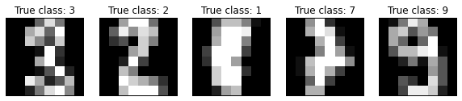
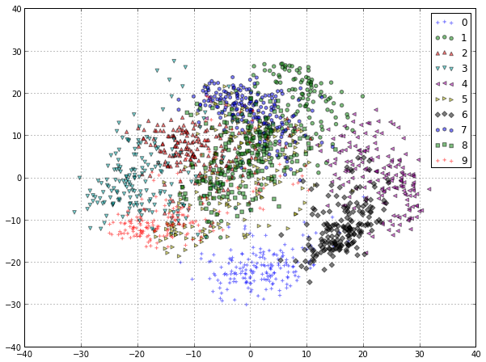
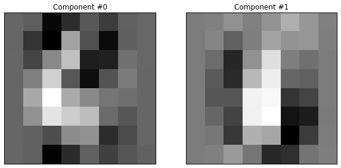

If you are looking for a neural networks based solution, see [here](http://rahular.com/digit-recognition-2).

In this post, I want to demonstrate how to use standard algorithms like SVM to solve some real world problems like learning to classify USPS&#8217; dataset of handwritten digits. For this, we will be using the well known <a href="http://scikit-learn.org/stable/" target="_blank">scikit-learn</a> library of Python. We will not delve deep into the mathematics of the process, but will mainly concentrate on getting the results we want. (Also, I assume you are familiar with at least the basics of Statistical Learning).

You can run the code on the python console or in IPython notebook (which will be easier). Also, you should have the scikit-learn installed on your system. If you don&#8217;t have it, you can install it by following these <a href="http://scikit-learn.org/stable/install.html" target="_blank">instructions</a>. First let us start by importing the libraries required :

```python
%pylab inline
import pylab as pl
import numpy as np

pl.rcParams['figure.figsize'] = 10, 7.5
pl.rcParams['axes.grid'] = True
pl.gray()
```

## The Hand Written Digits Dataset

Let&#8217;s load a simple dataset of 8&#215;8 gray level images of handwritten digits (bundled in the sklearn source code):
Load the dataset provided by scikit-learn and print it&#8217;s description

```python
from sklearn.datasets import load_digits
digits = load_digits()
print(digits.DESCR)
```

Print the input matrix and the classes into which each input has to be classified into. The input matrix contains 1797 rows (one for each image in the training data) and 64 columns (features/pixels of the image)

```python
X, y = digits.data, digits.target

print("data shape: %r, target shape: %r" % (X.shape, y.shape))
print("classes: %r" % list(np.unique(y)))
```

Print the dimensions of the matrix to clear things up

```python
n_samples, n_features = X.shape
print("n_samples=%d" % n_samples)
print("n_features=%d" % n_features)
```

Shows some images of the input data and their true classes

```python
def plot_gallery(data, labels, shape, interpolation='nearest'):
    for i in range(data.shape[0]):
        pl.subplot(1, data.shape[0], (i + 1))
        pl.imshow(data[i].reshape(shape), interpolation=interpolation)
        pl.title(labels[i])
        pl.xticks(()), pl.yticks(())

subsample = np.random.permutation(X.shape[0])[:5]
images = X[subsample]
labels = ['True class: %d' % l for l in y[subsample]]
plot_gallery(images, labels, shape=(8, 8))
```

The images should look something like this:



Let&#8217;s visualize the dataset in 2D using Principal Component Analysis:

```python
from sklearn.decomposition import RandomizedPCA

pca = RandomizedPCA(n_components=2)
%time X_pca = pca.fit_transform(X)

X_pca.shape
```

Build a scatterplot to better visualize the data (visualizing in 2D is way easier than visualizing in 64D!)

```python
from itertools import cycle

colors = ['b', 'g', 'r', 'c', 'm', 'y', 'k']
markers = ['+', 'o', '^', 'v', '&lt;', '&gt;', 'D', 'h', 's']
for i, c, m in zip(np.unique(y), cycle(colors), cycle(markers)):
    pl.scatter(X_pca[y == i, 0], X_pca[y == i, 1],
        c=c, marker=m, label=i, alpha=0.5)

_ = pl.legend(loc='best')
```

The scatterplot should look something like this:



We can observe that even in 2D, the groups of digits are quite well separated, especially the digit &#8220;0&#8243; that is very different from any other (the closest being &#8220;6&#8243; as it often share most the left hand side pixels). We can also observe that at least in 2D, there is quite a bit of overlap between the &#8220;1&#8243;, &#8220;2&#8243; and &#8220;7&#8243; digits.
To better understand the meaning of the &#8220;x&#8221; and &#8220;y&#8221; axes of this plot let us also visualize the values of the first two principal components that are used to compute this projection:

```python
labels = ['Component #%d' % i for i in range(len(pca.components_))]
plot_gallery(pca.components_, labels, shape=(8, 8))
```

The components look something like this:



## Overfitting

Overfitting is the problem of learning the training data by heart and being unable to generalize by making correct predictions on data samples unseen while training. To illustrate this, let&#8217;s train a Support Vector Machine naively on the digits dataset:

```python
from sklearn.svm import SVC
SVC().fit(X, y).score(X, y)
```

Did we really learn a perfect model that can recognize the correct digit class 100% of the time? Without new data it&#8217;s impossible to tell. Let&#8217;s start again and split the dataset into two random, non overlapping subsets:

```python
from sklearn.cross_validation import train_test_split

X_train, X_test, y_train, y_test = train_test_split(
    X, y, test_size=0.25, random_state=0)

print("train data shape: %r, train target shape: %r"
      % (X_train.shape, y_train.shape))
print("test data shape: %r, test target shape: %r"
      % (X_test.shape, y_test.shape))
```

Let&#8217;s retrain a new model on the training set:

```python
svc = SVC(kernel='rbf').fit(X_train, y_train)
train_score = svc.score(X_train, y_train) 
train_score
```

We can now test the performance of the model on the test set:

```python
test_score = svc.score(X_test, y_test)
test_score
```

48.6% !! This score is clearly not as good as expected! The model cannot generalize so well to new, unseen data. (**Note :** In this entire process, an **RBF kernel** is used along with the SVM)

  * Whenever the test data score is not as good as the train score the model is overfitting
  * Whenever the train score is not close to 100% accuracy the model is underfitting

Ideally we want to neither overfit nor underfit: `test_score ~= train_score ~= 1.0`. The previous example failed to generalize well to test data because we naively used the default parameters of the `SVC` class. Let&#8217;s try again with another parameterization (for the list of all parameters which can be tweaked click <a href="http://scikit-learn.org/stable/modules/generated/sklearn.svm.SVC.html" target="_blank">here</a>):

```python
svc_2 = SVC(kernel='rbf', C=100, gamma=0.001).fit(X_train, y_train)
svc_2.score(X_train, y_train)
svc_2.score(X_test, y_test)
```

99.3% !! In this case the model is almost perfectly able to generalize, at least according to our random train-test split.

## Cross Validation

Cross Validation is a procedure of repeating the train / test split several times so as to get a more accurate estimate of the real test score by averaging the values found on the individual runs.

The `sklearn.cross_validation` package provides many strategies to compute such splits using class that implement the python iterator API:

```python
from sklearn.cross_validation import ShuffleSplit

cv = ShuffleSplit(n_samples, n_iter=3, test_size=0.1,
    random_state=0)

for cv_index, (train, test) in enumerate(cv):
    print("# Cross Validation Iteration #%d" % cv_index)
    print("train indices: {0}...".format(train[:10]))
    print("test indices: {0}...".format(test[:10]))

    svc = SVC(kernel="rbf", C=1, gamma=0.001).fit(X[train], y[train])
    print("train score: {0:.3f}, test score: {1:.3f}\n".format(
        svc.score(X[train], y[train]), svc.score(X[test], y[test])))
```

Instead of doing the above manually, **sklearn.cross_validation** provides a little utility function to compute the cross validated test scores automatically:

```python
from sklearn.cross_validation import cross_val_score

svc = SVC(kernel="rbf", C=1, gamma=0.001)
cv = ShuffleSplit(n_samples, n_iter=10, test_size=0.1,
    random_state=0)

test_scores = cross_val_score(svc, X, y, cv=cv, n_jobs=2)
test_scores
```

```python
from scipy.stats import sem

def mean_score(scores):
    """Print the empirical mean score and standard error of the mean."""
    return ("Mean score: {0:.3f} (+/-{1:.3f})").format(
        np.mean(scores), sem(scores))
```

```python
print(mean_score(test_scores))
```

99.3% !! Thus we see that in the current configuration, the classification is close to perfect. So I think we have more or less solved the digit classification problem for the USPS :)

Until next time!
