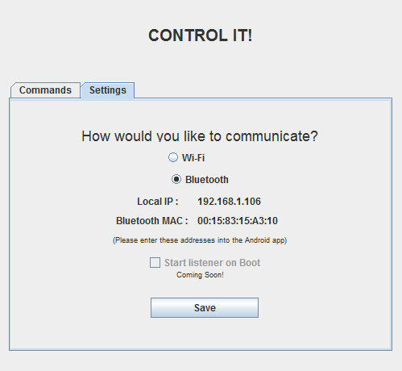
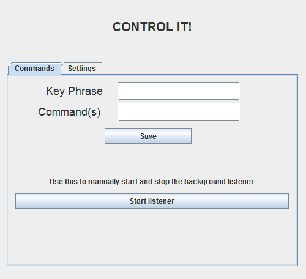

## How to setup Control It

  * If you do not have the Android app, you can download it <a href="https://play.google.com/store/apps/details?id=com.rahul.controlit" target="_blank">here</a>
  * Download the application for [Windows][1] or [Linux][2] for unzip it
  * Navigate to the folder in your terminal/dos-prompt and type : 
  
    ```
    java -jar ./ControlItWin.jar        (for Windows)
	java -jar ./ControlItLinux.jar      (for Linux)
	```
  * Go to the Settings panel which will look something like this



  *  Here you can find your computer&#8217;s IP address and Bluetooth MAC address
  * Go to **Settings** in the *Android app* and type the 2 addresses in
  * Now click on **Transmission**, and select the method of communication (say **Wifi**)

**Note** : If you want to use **Bluetooth**, make sure the phone and the computer are paired before continuing.*

  * On the computer, click on the **Commands** panel
  * You should get a screen which looks like this



  * Add any commands you wish to execute automatically and give it a &#8216;key phrase&#8217;
  * A &#8216;key phrase&#8217; can be a single or a group of words which will trigger the corresponding commands to be executed

  * For example, if you type it the below phrases into the text boxes in **Ubuntu**, Facebook opens in Chrome when you say &#8216;*open facebook* #8216; 
    
```
Key phrase : open facebook
Command(s) : google-chrome https://www.facebook.com
```

  * If you are in **Windows**, you will need to type this 
  
```
Key phrase : open facebook
Command(s) : start chrome https://www.facebook.com
```

  * Now you can **Save** it and click on **Start Listener**
  * You can then click on the glowing button in the *Android app* and say the key phrase
  * If everything goes well, Chrome should navigate to Facebook
  * Now create your own key phrase/command combo and have fun!

### What more can I do?

  * You can execute multiple commands with a single key phrase. You just have to delimit the commands with semicolon (;). Suppose for demonstration sake, you want to open Google in Chrome and play a song in VLC 

```
Key Phrase : execute (or anything cooler)
Command(s) : google-chrome http://www.google.com; vlc <songname>
```

  * Also remember to use `\` to escape any special characters such as double quotes
  * You can also run entire .bat/.sh files by providing their full paths in the **Command(s)** field

 [1]: ../res/ControlItWin.zip
 [2]: ../res/ControlItLinux.zip
