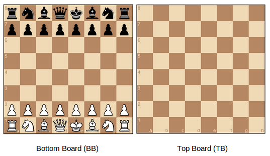
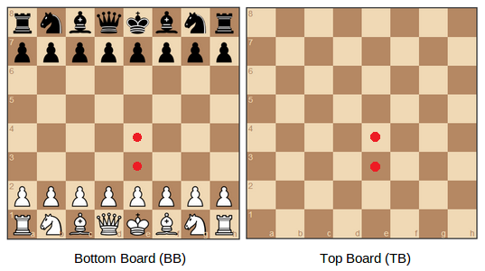
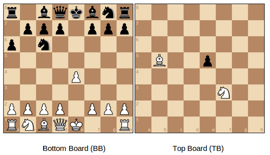
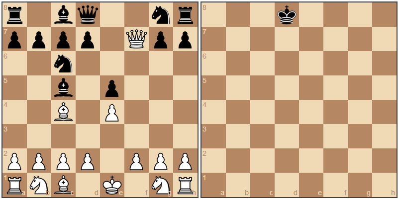

Chess is one of the most beautiful and complex board games conceived by humans. It takes great perseverance and determination to build the skill set required to play the game well. What if this inherent complexity of the game is increased just slightly to make the game more interesting without changing it’s essence? This is what ‘2 Layer Chess’ (2LC) tries to accomplish.

### How to play?

2LC retains everything that we know and love about chess. As the name suggests, it just adds a layer to the game; another board to be precise. 2LC has 2 boards, one on top of another. The players can use this extra space to attack in ways which are impossible with a single board.

Let’s look at the initial configuration

### Notations

All standard notations will hold, except for the fact that there will be 2 extra letters at the beginning of each square&#8217;s notation to identify to which layer it belongs to. For eg :

* `BBe4` - Bottom Board `e4`
* `TBe4` - Top Board `e4`

### Moves

All the pieces move in the same way as in the original game with an added option of jumping layers. That is an `e` pawn move to start off the game can now happen in 4 different ways rather than 2. That is, it can go to `BBe3`, `BBe4`, `TBe3` and `TBe4`. Note that all the pawns initially start out from the Bottom Board.

Also, any piece is free to make **one** jump per move. That is, a piece can either go from **TB** to **BB** or **BB** to **TB** in a move, but cannot jump over any blocking piece by jumping twice. For example,

Here, the Bishop on `BBc1` can move along the diagonal and make a jump to say `TBg5`. But it cannot be moved to `BBg5` as the pawn on `BBd2` is blocking it and no piece can make 2 jumps in the same move.

Also, the Bishop on `TBb5` can attack the Knight on `BBc6` as well as the pawn on `BBd7` as it does not violate the *single jump rule*. This means that the no piece is safe anymore and the players need to put in extra effort to safeguard their pieces. Also, they need to come up with more sophisticated mating maneuvers as simple mating tricks like the *Fool's Mate* will not work anymore as the next figure shows.

We can see how easy it is for the King to move away from a certain checkmate because of the additional space provided. We have just scratched the surface of what can be done using this sort of a setup.

## Technology

The 2 player version of this game can be easily built using existing chess APIs with minor modifications. Although a chess engine which plays such a game will require more work and would also be a nice research topic for people working on Machine Learning and AI. 
